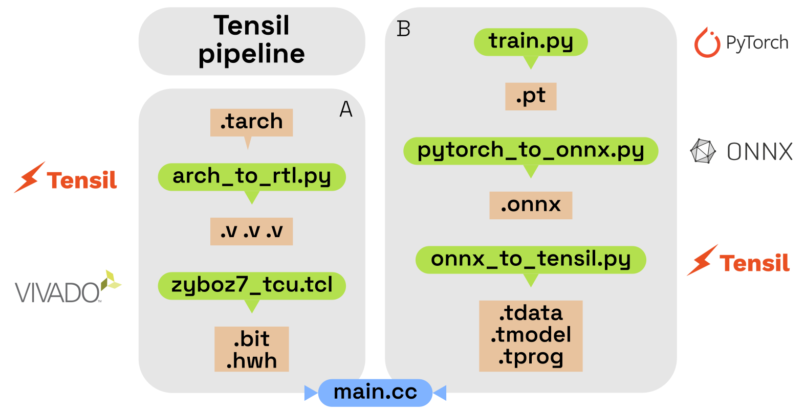

# Tensil Pipeline



We present 3 scripts to automatize the Tensil pipeline. It includes the process of converting, compiling, and generating the necessary files for deploying AI models on Tensil's hardware.

The pipeline consists of three main scripts:

- `pytorch_to_onnx.py`: Converts a PyTorch model to an ONNX graph, which is required for Tensil compilation and saves the generated ONNX model file (.onnx).
- `onnx_to_tensil.py`: Compiles the ONNX model into a Tensil-compatible format using a user-specified architecture and saves the compiled Tensil model files (.tmodel, .tarch, .tdata) and logs of the compilation process.
- `arch_to_rtl.py`: Converts a Tensil architecture file into Verilog files and saves the Verilog architecture files and logs of the compilation process.

# Scripts Usage
## PyTorch to ONNX Conversion

This script converts a PyTorch model to an ONNX graph format.

```bash
python3 pytorch_to_onnx.py -m <path_to_pytorch_model> -d <output_directory> -r <input_resolution> -i <input_tensor_name> -o <output_tensor_name>
```
Advice:
- Keep input and output tensor name to default.

## ONNX to Tensil Model Compilation

This script compiles the ONNX model into a Tensil model using a specified architecture.

```bash
sudo -E python3 onnx_to_tensil.py -o <path_to_onnx_model> -a <path_to_architecture_file> -d <output_directory> --onnx-output <onnx_output_name> [--no-rtl]
```

Advice:
- Always execute with `sudo -E` before python3 to execute with root and with the user environment because tensil execute via docker.
- Add `--no-rtl` to skip RTL generation.


## Tensil Architecture to RTL Conversion

This script converts a Tensil architecture file to Verilog files.

```bash
sudo -E python3 arch_to_rtl.py -a <path_to_architecture_file> -d <output_directory>
```

Advice:
- Always execute with `sudo -E` before python3 to execute with root and with the user environment because tensil execute via docker.


# Example Workflow

### Convert PyTorch model to ONNX:

```bash
python3 pytorch_to_onnx.py -m resnet50_tipu12.pth -d . 
```

### Compile ONNX model to Tensil:

```bash
sudo -E  python3 onnx_to_tensil.py -o resnet50_tipu12.onnx -a arch/zyboz7.tarch -d .
```

### Generate RTL from Tensil architecture:

```bash
sudo -E python3 arch_to_rtl.py -a arch/zyboz7.tarch -d .
```